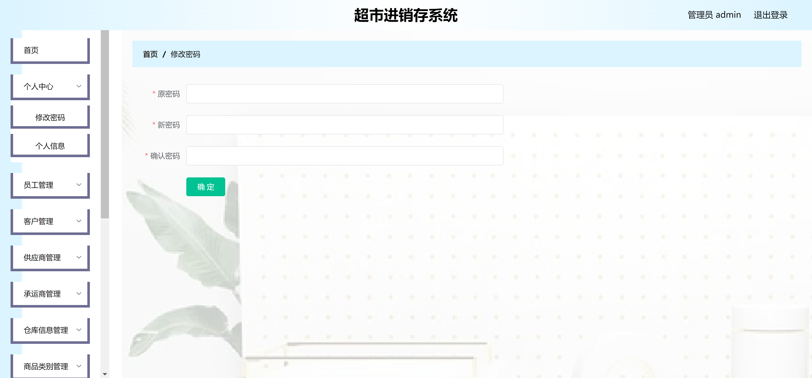
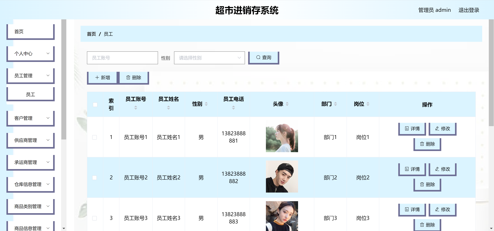
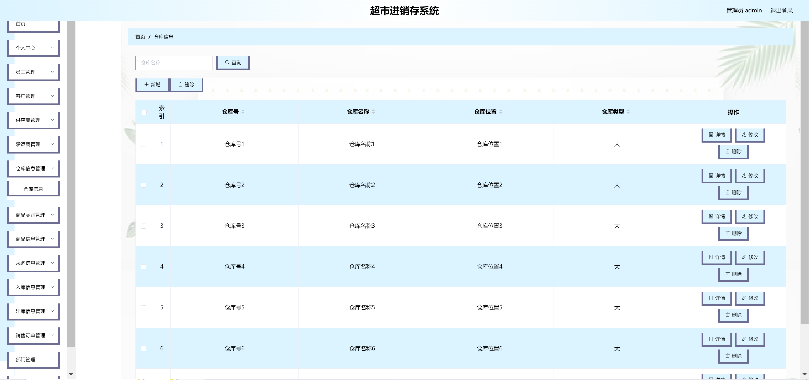
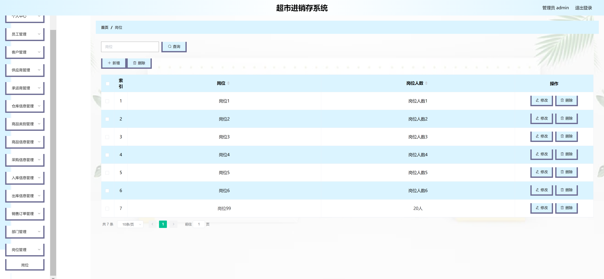

<h1 align="center">超市进销存管理系统</h1>

## 简介
超市进销存管理系统：角色分为管理员、员工；管理岗位信息、员工信息、客户、供应商、仓库、商品类别，支持登录、注册、修改密码等功能。    --计算机毕业设计源码；毕设源码；java毕业设计源码

## 联系方式

<h3 align="center">获取完整代码与数据库文件 + 微信：deepguan QQ: 86050149 QQ群: 783742310</h3>

<h3 align="center">可帮忙远程部署 包运行成功！提供远程部署、修改代码、设计文档指导、代码讲解等服务！</h3>

## 功能介绍（完整见运行截图）
管理员：管理员可以在系统中登录和注册，访问员工管理、客户管理、供应商管理、以及仓库信息管理等模块。通过员工管理界面，管理员能够查看、编辑、删除员工信息，进行新增员工和批量删除操作。管理员还可以通过仓库信息管理模块新增、删除和查询仓库信息，并进行详细查看和修改。   
员工：员工可以通过系统登录界面选择角色进行身份验证和账号管理。员工能够访问系统的个人中心，查看和修改个人信息，确保账户安全。此外，员工还可以通过功能菜单管理相关的信息和数据，如在客户管理或供应商管理模块中查看和编辑对应的数据细节。

## 运行截图

本代码来源于网络,仅供学习参考使用!

